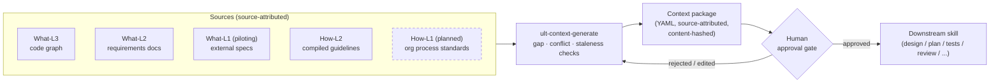
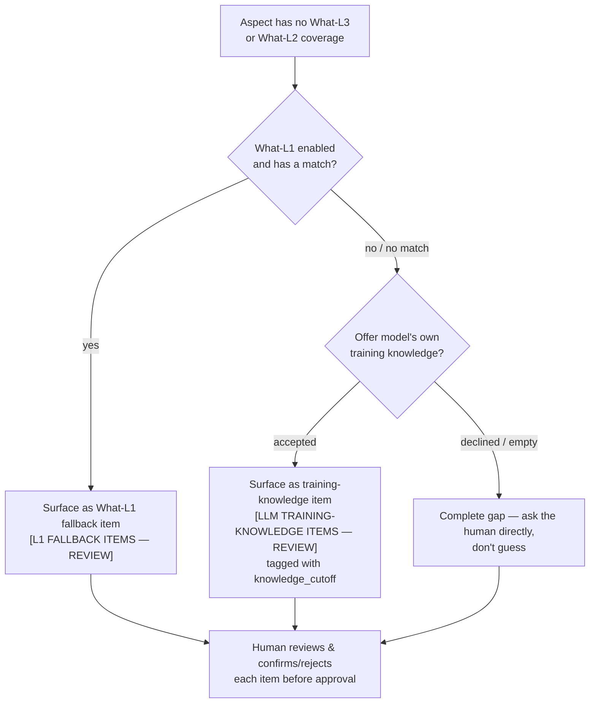

# The Context Engineering Protocol

> A written spec for how a coding agent should assemble, validate, and get approval for the
> context it works from — not just another retrieval trick.

This document explains the protocol in depth: the layer model, the gap → conflict → staleness
state machine, the human-approval gate, and the one layer that's specified but not yet built
(How-L1). For a shorter overview and a skill-by-skill index, see [`README.md`](README.md). For
what's planned next, see [`ROADMAP.md`](ROADMAP.md).

## 1. The problem this protocol addresses

Ask a coding agent to implement a feature and it will read *something* before writing code —
usually whatever files are nearest to the prompt, chosen by the agent's own judgment in the
moment. Three things go wrong with that by default:

1. **Nobody checks whether the sources agree.** A requirements doc can say one thing while the
   code already does another, or two "org conventions" documents can quietly contradict each
   other, and the agent has no reason to notice either.
2. **Nobody checks whether the sources are current.** A code graph built last week, or a compiled
   guidelines cache built before yesterday's refactor, looks exactly as authoritative as a fresh
   one — there's no signal that it might be stale.
3. **Nobody has to approve what the agent is about to treat as ground truth.** The agent decides
   what's relevant and proceeds, with no human checkpoint between "gathered context" and
   "generated code."

This protocol's centerpiece skill, `ult-context-generate`, exists to close all three gaps before
generation starts, not to make retrieval faster.

## 2. The layer model

Every claim in a context package traces back to one of five layers. Layer names follow a
`<What|How>-L<1|2|3>` convention: **What** layers describe product requirements/specs; **How**
layers describe process/convention. The number is a maturity/scope tier, not a ranking of
importance.

| Layer | What it is | Status | Where it lives |
|---|---|---|---|
| **What-L3** | The code itself — a generated knowledge graph of cross-file relationships | Implemented | `ult-codegraph` (`graphify`) |
| **What-L2** | This product's own requirements/spec documents | Implemented | `docs/requirements/` (path configurable) |
| **What-L1** | External references — industry standards, competitor docs, architecture whitepapers (e.g. 3GPP, ISO, IEEE) | **Piloting** | `specs/external/` (path configurable), indexed by `md_index.py` |
| **How-L2** | Your org's compiled, scope-aware conventions (style guides, templates, examples) | Implemented | `compiling-project-guidelines`, cached as `COMPILED-GUIDELINES.md` |
| **How-L1** | Org-wide **process** standards (CMMI, ISO 9001, IEEE process standards, etc.) | **Not yet implemented** — see §5 | n/a |

**Why external specs (What-L1) rank below your own docs (What-L2/L3):** an external standard
describes what the *industry* does, not what *this product* does or requires. When a What-L1
item gets pulled into a context package, it's tagged `what_l1_fallback: true` and shown to the
human reviewer in a dedicated block — informative, never treated as authoritative for this
product without a human saying so.

## 3. How a context package gets built

A context package isn't retrieved once and cached forever — it's assembled fresh for a specific
feature/task, per **aspect** (a feature is broken into a small set of aspects — e.g. an existing
baseline plus the new delta being added — so a gap in the new part isn't hidden by coverage that
only applies to the old part).

### 3.1 Conflict detection — blocks

Before anything is assembled, sources are checked against each other: does a requirement
contradict what the code graph shows? Do two How-L2 convention sources disagree? A genuine
contradiction is not something the agent resolves on its own — **it stops and asks a human**,
concretely: "`<decision topic>` was decided as `<X>` here but `<Y>` there — which is right?"
Nothing proceeds on the contested point until that's answered.

### 3.2 Gap detection — falls through layers, never guesses

For each aspect, coverage is checked top-down: does the code (What-L3) cover it? Do the
requirements (What-L2) cover it? If **both** come up empty, the protocol doesn't let the agent
silently fill the hole from its own judgment — it falls through a defined sequence:

Every fallback item — whether sourced from an external spec or the model's own training data —
carries an explicit provenance tag and sits in its own reviewer block. Nothing enters an approved
package without a human confirming it belongs there.

### 3.3 Staleness detection — non-blocking, but never silent

Two things can go stale between when a source was built and when it's used: the code graph (was
it built from the current commit?) and the compiled-guidelines cache (has anything it was built
from changed since?). Staleness is checked but **doesn't block** — the protocol surfaces a
one-line nudge ("graph built from `<old-commit>`, current is `<head>` — consider re-running
`ult-codegraph`") and proceeds with what's available. The judgment call — is a slightly stale
graph good enough right now, or does this feature need a fresh one — stays with the human, not
the agent.

### 3.4 The human-approval gate

Once gaps and conflicts are resolved (or explicitly deferred with the human's sign-off), the
package is assembled: every item source-attributed to a `file:line-range` or an external
reference, every decision logged. It is presented for review — **not saved as final until a
human explicitly approves it.** This is the one property that separates this protocol from
"the agent read some files and proceeded": nothing downstream trusts a package that hasn't been
looked at.

Approved packages are content-hashed and tagged (`<package-id>@<hash8>`), so any consumer can
tell later whether the package it's citing has drifted since approval — see
[`CONSUMING-CONTEXT-PACKAGE.md`](.github/skills/ult-context-generate/CONSUMING-CONTEXT-PACKAGE.md)
for the full consumption contract, or
[`user_guides/topics/consuming-a-context-package.md`](user_guides/topics/consuming-a-context-package.md)
for a shorter, friendlier on-ramp.

## 4. What makes this a protocol, not a tool

A few properties are deliberately non-negotiable across every skill in this repo, because
they're what "protocol" means here rather than "product":

- **Every claim is source-attributed.** A `context_items` entry always names where it came from
  — a file:line-range, an external doc, or (explicitly labeled) the model's own training
  knowledge. Nothing is asserted without a citation.
- **Conflicts block; gaps fall through a defined sequence; staleness nudges.** These are three
  distinct failure modes with three distinct handling rules — never collapsed into one generic
  "warning."
- **The human-approval gate is mandatory, not configurable away.** A context package that hasn't
  been approved is not a context package a downstream skill should trust.
- **Consumption is a documented contract, not folklore.** Any skill that wants to use an approved
  package follows the same numbered steps (discover → confirm → load → spot-check → cite →
  tag) — see §3.4's links.

## 5. How-L1 — specified now, built later (Phase 2)

**How-L1 is not implemented today.** `context-config.yaml`'s `how_l1` section exists and is
always `enabled: false`; there is no query step in `ult-context-generate` that reads it yet. This
section describes its intended design so the protocol names its own shape honestly, rather than
leaving a layer undefined until someone gets around to building it. Tracked as the #1 item in
[`ROADMAP.md`](ROADMAP.md).

**What it would ingest:** org-wide *process* standards — the kind of thing a CMMI appraisal, an
ISO 9001 quality manual, or an IEEE process standard describes — as distinct from How-L2's
project-specific compiled conventions (style guides, templates, examples). Where How-L2 answers
"how does *this team* format a design doc," How-L1 would answer "what does *this
organization's* quality process require of any design doc, regardless of team."

**Where it would slot in:** between the existing Step 2 (How-L2 org convention check) and Step 3
of `ult-context-generate`'s flow — a new query step reading `how_l1.path`, structurally parallel
to how What-L1 (§2 above) already works: build a deterministic index once, query it per aspect,
surface matches as gated review items rather than auto-including them.

**How it would be gated:** the same way What-L1 fallback items are gated today — a dedicated
`[HOW-L1 FALLBACK ITEMS — REVIEW]` block at the human-review step, tagged with provenance, never
auto-approved. A How-L1 item describes what the *organization's process* requires, not what
*this product* does — the same "informative, not automatically authoritative" caveat that
applies to What-L1 items today applies here too.

**What exists today instead:** the supported path for org-wide process guidance right now is
**How-L2** — drop relevant excerpts or summaries into `org/guidelines/` as narrative content.
It's manual (someone has to curate the excerpt) rather than indexed/queried automatically, but it
works today. Full How-L1 support means a config schema change and a new Step 2 sub-flow — real
scope, which is why it's Phase 2 rather than a small addition. Open an issue in this repo if
having it would unblock your project; that's the signal this gets prioritized against other
Phase-2 items.

## 6. Runtime adapters are generated, the protocol isn't

One more property worth naming explicitly: the protocol content (each `SKILL.md`, its
consumption contract, its config schema) is written once, in Claude Code's native format, and
every other runtime's adapter (`.prompt.md` for Copilot, `.mdc` for Cursor, `AGENTS.md` rows for
Codex) is **generated from it** by `catalog/export_adapters.py` — never hand-duplicated. See
[`README.md`](README.md#runtime-support) for current per-runtime validation status.
