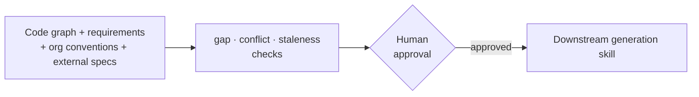

# Context Engineering Protocol

[](https://github.com/linkpranay-ai/context-engineering-protocol/actions/workflows/ci.yml)
[](LICENSE)
[](https://github.com/linkpranay-ai/context-engineering-protocol/releases/tag/v0.1.0)

**[Protocol](PROTOCOL.md) · [Glossary](GLOSSARY.md) · [Quickstart](#quickstart) ·
[Skills](#skills-in-this-repo) · [Runtime support](#runtime-support) · [Roadmap](ROADMAP.md) ·
[Contributing](CONTRIBUTING.md)**

> Don't let the agent guess what's true. Make it prove the context agrees, then get a human to
> sign off before it writes a line of code.

A set of AI-coding-agent skills that assemble a **human-approved, source-attributed context
package** — code graph + requirements + org conventions + constraints — before a generation task
runs, instead of letting the agent free-read the repo and guess.

Built for Claude Code / GitHub Copilot; adaptable to Cursor and OpenAI Codex (see
[Runtime support](#runtime-support) below).

## Why this exists

Most "give the agent context" tools stop at retrieval: chunk the repo, embed it, hand back
whatever's nearest to the prompt. That's fine for lookups. It's not enough for a change that
touches requirements, org conventions, and code at once — because nothing checks whether those
three sources actually agree, or whether the code graph they're reasoning from is still current.

This protocol's centerpiece, [`ult-context-generate`](.github/skills/ult-context-generate/SKILL.md),
runs an explicit **gap → conflict → staleness** state machine before anything gets generated, and
gates the result behind a human-approval step:



- **Gap detection** — per requirement aspect, is it covered by code, by docs, by neither?
- **Conflict detection** — does a requirement doc contradict what the code graph shows, or do two
  org-convention sources disagree with each other? Unresolved conflicts **block** approval.
- **Staleness detection** — was the code graph or the compiled-guidelines cache built from a commit
  that's no longer HEAD? Surfaced as a nudge, not a block.

The package that comes out the other side is source-attributed (every claim traces to a
file/section) and content-hashed, and requires a human to explicitly approve it before a
downstream skill consumes it — this is deliberately not a fully autonomous pipeline. See
[`PROTOCOL.md`](PROTOCOL.md) for the full layer model, the state machine in detail, and how the
piloting How-L1 layer is gap-triggered off How-L2.

That's the difference from Cline's Memory Bank (persistent notes, no conflict/staleness checking),
Cursor's `.cursorrules` (static convention injection, no code-graph grounding), and generic
RAG-over-docs frameworks (retrieval without a gate): this protocol treats "is the context still
true" as a first-class question, not an assumption.

## Quickstart

Clone this repo, then copy its skill set into your target project:

```sh
git clone https://github.com/linkpranay-ai/context-engineering-protocol.git
cd context-engineering-protocol
./install.sh --target /path/to/your/project --init-project   # or install.ps1 -TargetPath ... -InitProject
```

That copies `.github/skills/`, `.github/prompts/`, `.cursor/rules/`, and `AGENTS.md` into your
project, and (with `--init-project`/`-InitProject`) scaffolds a starter `context-config.yaml`.
Re-running is safe — library files are refreshed, project-owned files (like a filled-in
`context-config.yaml`) are left alone. Run `./install.sh --help` / `Get-Help ./install.ps1` for
the full flag list, including `--dry-run`/`-DryRun` and `--only`/`-Only <skill1,skill2>` to
install just a subset of skills instead of the full set.

Then see [`user_guides/topics/project-setup-context-engineering.md`](user_guides/topics/project-setup-context-engineering.md)
for the two setup paths:

- **Path A** (simple) — just compile scattered guideline sources into one conflict-checked
  `COMPILED-GUIDELINES.md` for any AI agent to read. 3 steps.
- **Path B** (full pipeline) — code graph + requirements + constraints assembled into a full
  context package, then handed to a downstream generation skill. 9 steps, using
  [`demo-consume-context`](.github/skills/demo-consume-context/SKILL.md) as a worked example of
  what "consuming" a context package looks like.

## Skills in this repo

| Skill | What it does |
|---|---|
| [`compiling-project-guidelines`](.github/skills/compiling-project-guidelines/SKILL.md) | Compile scattered guideline sources into one scope-aware `COMPILED-GUIDELINES.md` for other skills and `ult-context-generate`'s Constraints layer. |
| [`ult-codegraph`](.github/skills/ult-codegraph/SKILL.md) | Generate a codebase knowledge graph with `graphify` so other skills can query cross-file relationships before touching code. |
| [`ult-context-generate`](.github/skills/ult-context-generate/SKILL.md) | Assemble a context package (code graph, requirements, constraints, blast radius) before a downstream generation task runs — human-approved, source-attributed. |
| [`ult-repo-layout`](.github/skills/ult-repo-layout/SKILL.md) | Register, resolve, and validate where a project's path-slots actually live via `.layout-slots.yaml` markers, so relocating a slot needs zero `SKILL.md` edits. |
| [`demo-consume-context`](.github/skills/demo-consume-context/SKILL.md) | Worked example that discovers, loads, and tags a context package per `CONSUMING-CONTEXT-PACKAGE.md` — proves the produce/consume/tag loop end-to-end. |

Each skill's `SKILL.md` frontmatter carries `tier`/`origin`/`tags`/`bundle` per the Agent Skills
convention, with an explicit "Do NOT use for..." clause to keep triggering unambiguous.

## Consuming a context package

Building a skill that should *use* an approved context package instead of free-reading the repo?
Start with [`user_guides/topics/consuming-a-context-package.md`](user_guides/topics/consuming-a-context-package.md)
— a plain-language, 10-minute walkthrough of discover → confirm → load → cite → tag. For a
working reference implementation, read [`demo-consume-context`](.github/skills/demo-consume-context/SKILL.md).
The full formal contract (addenda, multi-package edge cases, tag-discovery rules) lives in
[`CONSUMING-CONTEXT-PACKAGE.md`](.github/skills/ult-context-generate/CONSUMING-CONTEXT-PACKAGE.md).

## Roadmap

What's planned next — comprehensive How-L1 validation, Cursor live-install testing, and more — is
tracked in [`ROADMAP.md`](ROADMAP.md), roughly prioritized.

## Runtime support

| Runtime | Support |
|---|---|
| Claude Code | Native — `SKILL.md` files under `.github/skills/` |
| GitHub Copilot | `.prompt.md` wrappers under `.github/prompts/`, one per skill. `ult-context-generate`, `ult-codegraph`, and `demo-consume-context` are hand-authored (with skill-specific "When invoked directly" steps); `ult-repo-layout` and `compiling-project-guidelines` are generated by `catalog/export_adapters.py` from `SKILL.md` frontmatter. |
| Cursor | `.cursor/rules/<skill>.mdc` per skill (Agent Requested activation — `description` set, `alwaysApply: false`), generated by `catalog/export_adapters.py`. |
| OpenAI Codex | Root `AGENTS.md` table (skill → description → `SKILL.md` path), generated by `catalog/export_adapters.py`. |

**Claude Code is dogfood-validated** (Phase 9): all four real skills (`ult-repo-layout`,
`ult-codegraph`, `compiling-project-guidelines`, `ult-context-generate`) were run end-to-end,
by hand, against a freshly cloned, unrelated real-world repo (`Textualize/textual`) — not just
read for correctness. `validate_layout.py --validate` passed; `graphify update` produced a real
20,496-node / 59,448-edge graph from 1,353 source files; a real `COMPILED-GUIDELINES.md` was
compiled from that repo's own `CONTRIBUTING.md`/`AI_POLICY.md`; and a full context package was
assembled end-to-end for a real, grounded feature scenario using real `graphify query/explain/affected`
calls and a real `md_index.py`-built index.

**Copilot is field-validated** (Phase 9): in the same dogfood clone, real interactive Copilot Chat
runs confirmed `/ult-repo-layout` and `/ult-context-generate` both load the real `.prompt.md`
wrapper and follow through into the real `SKILL.md` content — not a generic/hallucinated response.
`/ult-repo-layout` actually opened the real marker files and ran the real `validate_layout.py
--validate` script, returning a literal `PASS`. `/ult-context-generate` asked the real Step 1
scope-clarification questions (5/5, correct substance) and respected a "stop after Step 1"
instruction with no files written. See `dogfood-textual/PHASE9-RUNTIME-SPOTCHECK.md` for the full
transcript evidence.

**Codex is field-validated via Codex Desktop** (Phase 9), with one known caveat on the VS Code
extension surface. The Codex VS Code extension's chat panel hung indefinitely on any file-read
tool call (reproduced twice — once in a multi-root workspace, once with the dogfood clone opened
standalone — while responding normally to plain chat), a defect in that extension's tool-call path
unrelated to this project's skills or adapters. Switching to **Codex Desktop** against the same
`dogfood-textual` clone bypassed that surface entirely and passed cleanly: it found and read the
root `AGENTS.md` unprompted, correctly listed all four real skills with descriptions matching the
table (not invented ones), and gave an accurate summary of `ult-repo-layout`'s `discover` mode
after actually opening the real `SKILL.md`. So the `AGENTS.md` adapter itself is confirmed working
— the still-open gap is narrower: the VS Code *extension panel's* file-read path, not Codex or this
project's Codex support. See `dogfood-textual/PHASE9-RUNTIME-SPOTCHECK.md` for both transcripts.

Cursor's adapter is generated deterministically from each skill's `SKILL.md` frontmatter and
verified against Cursor's currently published docs, but **has not been live-install-tested**
against a real Cursor installation — see "What's not yet done" below. Run
`python catalog/export_adapters.py --check` (wired into CI) to confirm generated files are current;
`--write` regenerates them after adding or editing a skill.

## What's not yet done

Disclosed plainly rather than glossed over. Full prioritized list with more detail:
[`ROADMAP.md`](ROADMAP.md).

- **How-L1** (org-wide process-standard ingestion, e.g. CMMI/ISO/IEEE) is piloting, not yet
  field-validated against a real corpus — gap-triggered off How-L2 and task-type-scoped rather
  than per-aspect, with no web-search fallback of its own. See
  [`PROTOCOL.md`](PROTOCOL.md#5-how-l1--gap-triggered-task-type-scoped-piloting).
- **Codegraph validation is general-purpose, not domain-specific.** The C/C++ validation examples
  cover general constructs (e.g. `re2`, `protobuf`), not any particular embedded or telecom domain.
- **Token-cost claims for `ult-context-generate` are partly self-reported** and have not yet been
  independently measured against a real, large repo. `scripts/usage_report.py` (ROADMAP item 7)
  can aggregate real per-run token counts once they're recorded via the optional `tokens_used`
  addenda field — but no measured figure exists yet.
- **No capability-profile / tool-restriction field** (e.g. an `allowed-tools`-style frontmatter key)
  exists yet on any skill.
- **Cursor is not installed and its adapter is not live-install-tested.** `catalog/export_adapters.py`
  generates `.cursor/rules/*.mdc` deterministically from each skill's `SKILL.md` frontmatter, and
  the output format was checked against Cursor's currently published docs — but it has not been
  confirmed against a real Cursor install actually picking up and invoking a skill end-to-end.
  Treat it as documentation-verified, not field-verified, until that happens.
- **Codex itself is field-validated via Codex Desktop** (see "Runtime support" above: it found
  and read the real `AGENTS.md` unprompted and correctly listed every skill). **The Codex VS Code
  extension was not tested** — its chat panel hangs indefinitely on any file-read tool call, a
  defect in that extension's own tool-call path, unrelated to this project's skills or adapters
  (confirmed by Codex Desktop completing the same test cleanly against the same clone). See
  `dogfood-textual/PHASE9-RUNTIME-SPOTCHECK.md` for both transcripts.

## Contributing

See [`CONTRIBUTING.md`](CONTRIBUTING.md).

## License

Apache License 2.0 — see [`LICENSE`](LICENSE) and [`NOTICE`](NOTICE).
