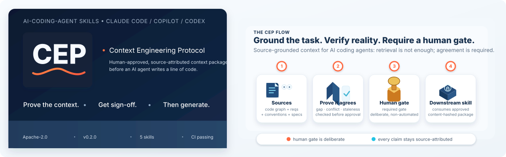
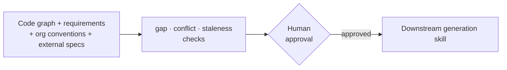

<p align="center">

</p>

<p align="center">

[](https://github.com/linkpranay-ai/context-engineering-protocol/actions/workflows/ci.yml)
[](LICENSE)
[](https://github.com/linkpranay-ai/context-engineering-protocol/releases/tag/v0.2.0)

</p>

**[Protocol](PROTOCOL.md) · [Glossary](GLOSSARY.md) · [Conformance](CONFORMANCE.md) ·
[Quickstart](#quickstart) · [Skills](#skills-in-this-repo) · [Runtime support](#runtime-support) ·
[Roadmap](ROADMAP.md) · [Evidence methodology](EVIDENCE-METHODOLOGY.md) ·
[Contributing](CONTRIBUTING.md)**

> Don't let the agent guess what's true. Make it prove the context agrees, then get a human to
> sign off before it writes a line of code.

A set of AI-coding-agent skills that assemble a **human-approved, source-attributed context
package** — code graph + requirements + org conventions + constraints — before a generation task
runs, instead of letting the agent free-read the repo and guess.

Built for Claude Code / GitHub Copilot; adaptable to Cursor and OpenAI Codex (see
[Runtime support](#runtime-support) below).

**In practice:** dogfood-validated on a real 1,353-file external repo across Claude Code, GitHub
Copilot, and Codex Desktop; measured against three further real corpora in the
[case studies](#case-studies) below, including one deliberate negative control.

## Why this exists

Most "give the agent context" tools stop at retrieval: chunk the repo, embed it, hand back
whatever's nearest to the prompt. That's fine for lookups. It's not enough for a change that
touches requirements, org conventions, and code at once — because nothing checks whether those
three sources actually agree, or whether the code graph they're reasoning from is still current.

This protocol's centerpiece, [`ult-context-generate`](.github/skills/ult-context-generate/SKILL.md),
runs an explicit **gap → conflict → staleness** state machine before anything gets generated, and
gates the result behind a human-approval step:


```mermaid
flowchart LR
    Sources["Code graph + requirements<br/>+ org conventions + external specs"] --> Engine["gap · conflict · staleness<br/>checks"]
    Engine --> Gate{"Human<br/>approval"}
    Gate -- approved --> Consumer["Downstream generation skill"]
```

- **Gap detection** — per requirement aspect, is it covered by code, by docs, by neither?
- **Conflict detection** — does a requirement doc contradict what the code graph shows, or do two
  org-convention sources disagree with each other? Unresolved conflicts **block** approval.
- **Staleness detection** — was the code graph or the compiled-guidelines cache built from a commit
  that's no longer HEAD? Surfaced as a nudge, not a block.

The package that comes out the other side is source-attributed (every claim traces to a
file/section) and content-hashed, and requires a human to explicitly approve it before a
downstream skill consumes it — this is deliberately not a fully autonomous pipeline. See
[`PROTOCOL.md`](PROTOCOL.md) for the full layer model, the state machine in detail, and how the
piloting How-L1 layer is gap-triggered off How-L2.

That's the difference from Cline's Memory Bank (persistent notes, no conflict/staleness checking),
Cursor's `.cursorrules` (static convention injection, no code-graph grounding), and generic
RAG-over-docs frameworks (retrieval without a gate): this protocol treats "is the context still
true" as a first-class question, not an assumption.

## Quickstart

Clone this repo, then copy its skill set into your target project:

```sh
git clone https://github.com/linkpranay-ai/context-engineering-protocol.git
cd context-engineering-protocol
./install.sh --target /path/to/your/project --init-project   # or install.ps1 -TargetPath ... -InitProject
```

That copies `.github/skills/`, `.github/prompts/`, `.cursor/rules/`, and `AGENTS.md` into your
project, and (with `--init-project`/`-InitProject`) scaffolds a starter `context-config.yaml`.
Re-running is safe — library files are refreshed, project-owned files (like a filled-in
`context-config.yaml`) are left alone. Run `./install.sh --help` / `Get-Help ./install.ps1` for
the full flag list, including `--dry-run`/`-DryRun` and `--only`/`-Only <skill1,skill2>` to
install just a subset of skills instead of the full set.

Then see [`user_guides/topics/project-setup-context-engineering.md`](user_guides/topics/project-setup-context-engineering.md)
for the two setup paths:

- **Path A** (simple) — just compile scattered guideline sources into one conflict-checked
  `COMPILED-GUIDELINES.md` for any AI agent to read. 3 steps.
- **Path B** (full pipeline) — code graph + requirements + constraints assembled into a full
  context package, then handed to a downstream generation skill. 9 steps, using
  [`demo-consume-context`](.github/skills/demo-consume-context/SKILL.md) as a worked example of
  what "consuming" a context package looks like.

## Skills in this repo

| Skill | What it does |
|---|---|
| [`compiling-project-guidelines`](.github/skills/compiling-project-guidelines/SKILL.md) | Compile scattered guideline sources into one scope-aware `COMPILED-GUIDELINES.md` for other skills and `ult-context-generate`'s Constraints layer. |
| [`ult-codegraph`](.github/skills/ult-codegraph/SKILL.md) | Generate a codebase knowledge graph with `graphify` so other skills can query cross-file relationships before touching code. |
| [`ult-context-generate`](.github/skills/ult-context-generate/SKILL.md) | Assemble a context package (code graph, requirements, constraints, blast radius) before a downstream generation task runs — human-approved, source-attributed. |
| [`ult-repo-layout`](.github/skills/ult-repo-layout/SKILL.md) | Register, resolve, and validate where a project's path-slots actually live via `.layout-slots.yaml` markers, so relocating a slot needs zero `SKILL.md` edits. |
| [`demo-consume-context`](.github/skills/demo-consume-context/SKILL.md) | Worked example that discovers, loads, and tags a context package per `CONSUMING-CONTEXT-PACKAGE.md` — proves the produce/consume/tag loop end-to-end. |

Each skill's `SKILL.md` frontmatter carries `tier`/`origin`/`tags`/`bundle` per the Agent Skills
convention, with an explicit "Do NOT use for..." clause to keep triggering unambiguous.

## Consuming a context package

Building a skill that should *use* an approved context package instead of free-reading the repo?
Start with [`user_guides/topics/consuming-a-context-package.md`](user_guides/topics/consuming-a-context-package.md)
— a plain-language, 10-minute walkthrough of discover → confirm → load → cite → tag. For a
working reference implementation, read [`demo-consume-context`](.github/skills/demo-consume-context/SKILL.md).
The full formal contract (addenda, multi-package edge cases, tag-discovery rules) lives in
[`CONSUMING-CONTEXT-PACKAGE.md`](.github/skills/ult-context-generate/CONSUMING-CONTEXT-PACKAGE.md).

## Roadmap

What's planned next — comprehensive How-L1 validation, Cursor live-install testing, and more — is
tracked in [`ROADMAP.md`](ROADMAP.md), roughly prioritized.

## Runtime support

| Runtime | Support |
|---|---|
| Claude Code | Native — `SKILL.md` files under `.github/skills/` |
| GitHub Copilot | `.prompt.md` wrappers under `.github/prompts/`, one per skill. `ult-context-generate`, `ult-codegraph`, and `demo-consume-context` are hand-authored (with skill-specific "When invoked directly" steps); `ult-repo-layout` and `compiling-project-guidelines` are generated by `catalog/export_adapters.py` from `SKILL.md` frontmatter. |
| Cursor | `.cursor/rules/<skill>.mdc` per skill (Agent Requested activation — `description` set, `alwaysApply: false`), generated by `catalog/export_adapters.py`. |
| OpenAI Codex | Root `AGENTS.md` table (skill → description → `SKILL.md` path), generated by `catalog/export_adapters.py`. |

**Claude Code — dogfood-validated** (Phase 9): all four real skills run end-to-end, by hand,
against a freshly cloned, unrelated real-world repo (`Textualize/textual`) — not just read for
correctness.

- `validate_layout.py --validate` passed.
- `graphify update` produced a real 20,116-node / 59,448-edge graph from 1,353 source files.
- A real `COMPILED-GUIDELINES.md` was compiled from that repo's own `CONTRIBUTING.md`/`AI_POLICY.md`.
- A full context package was assembled end-to-end for a real, grounded feature scenario using real
  `graphify query/explain/affected` calls and a real `md_index.py`-built index.

**Copilot — field-validated** (Phase 9): in the same dogfood clone, real interactive Copilot Chat
runs confirmed both `/ult-repo-layout` and `/ult-context-generate` load the real `.prompt.md`
wrapper and follow through into the real `SKILL.md` content — not a generic/hallucinated response.

- `/ult-repo-layout` opened the real marker files and ran `validate_layout.py --validate`,
  returning a literal `PASS`.
- `/ult-context-generate` asked the real Step 1 scope-clarification questions (5/5, correct
  substance) and respected a "stop after Step 1" instruction with no files written.
- Transcript kept in the local dogfood clone (`dogfood-textual/`, not part of this repo — see
  "Reproduction steps" in the [Textual case study](case-studies/textual/CASE-STUDY.md) to
  reproduce the clone and re-run the same check yourself).

**Codex — field-validated via Codex Desktop** (Phase 9), with one known caveat on the VS Code
extension surface.

- Codex Desktop found and read the root `AGENTS.md` unprompted, correctly listed all four real
  skills with descriptions matching the table, and gave an accurate summary of `ult-repo-layout`'s
  `discover` mode after actually opening the real `SKILL.md`.
- The Codex **VS Code extension**'s chat panel hung indefinitely on any file-read tool call
  (reproduced twice — once in a multi-root workspace, once with the dogfood clone opened
  standalone — while responding normally to plain chat), a defect in that extension's own
  tool-call path, unrelated to this project's skills or adapters.
- Codex Desktop completing the same test cleanly against the same clone confirms the `AGENTS.md`
  adapter itself works; the still-open gap is narrower than "Codex support" — it's the VS Code
  *extension panel's* file-read path.
- Transcript kept in the local dogfood clone (`dogfood-textual/`, not part of this repo — see
  "Reproduction steps" in the [Textual case study](case-studies/textual/CASE-STUDY.md) to
  reproduce the clone and re-run the same check yourself).

Cursor's adapter is generated deterministically from each skill's `SKILL.md` frontmatter and
verified against Cursor's currently published docs, but **has not been live-install-tested**
against a real Cursor installation — see "What's not yet done" below. Run
`python catalog/export_adapters.py --check` (wired into CI) to confirm generated files are current;
`--write` regenerates them after adding or editing a skill.

## Case studies

Real, reproducible reports of running this protocol against real codebases, including at least one
deliberate negative control showing where it adds little or no value. See
[`case-studies/README.md`](case-studies/README.md) for the index and
[`case-studies/TEMPLATE.md`](case-studies/TEMPLATE.md) for the format every case follows.

### Measured impact

Every number below is tool-measured (`graphify benchmark`, or a naive-keyword-search baseline
reused from each case's own reproduction steps), not self-reported — see
[`EVIDENCE-METHODOLOGY.md`](EVIDENCE-METHODOLOGY.md) §4-§6 for exactly what "measured" means here.

| Case | Corpus | Task-level token reduction | `graphify benchmark` reduction | Graph size |
|---|---|---|---|---|
| [Open5GS + RFC 6733](case-studies/open5gs-ietf-rfc/CASE-STUDY.md) | `open5gs/open5gs`, C, AGPL-3.0 | **~797x** on the external-spec clause lookup (43,599 words naive vs. 55 words CEP) | 36.8x fewer tokens/query | 3,830 nodes / 10,236 edges |
| [FastAPI](case-studies/fastapi/CASE-STUDY.md) | `fastapi/fastapi`, Python, MIT | ~15.3x (15,767 words naive vs. 1,030 words CEP) | 5.6x fewer tokens/query — smallest of the three | 911 nodes / 2,568 edges |
| [Textual](case-studies/textual/CASE-STUDY.md) | `Textualize/textual`, Python, MIT | Run A: ~17.6x. **Run B (negative control): naive read was cheaper** (551 vs. 902 words) | 39.6x fewer tokens/query — largest of the three | 20,116 nodes / 59,448 edges |

**What actually drives the win:** reduction tracks how much of the task's answer lives in a prose
spec with no keyword to grep for, not how large the codebase is — FastAPI's graph sits between the
other two in size but shows the smallest reduction. The largest measured win (~797x) is a direct
`clause_id` lookup replacing a full read of an ~8,500-line external RFC; for in-repo,
keyword-findable code, CEP's edge narrows to disambiguation and certainty rather than discovery, and
in one deliberately chosen case (Textual Run B) reverses outright — three tool outputs agreed there
was nothing worth assembling context for, and the naive read won. Every comparison above is
retrospective against a task whose answer was already known, not a blind trial — see
[`case-studies/SYNTHESIS.md`](case-studies/SYNTHESIS.md) for the full analysis, limitations, and
what these three cases do and don't support.

**The table above measures retrieval cost. Two further cases measure a different question: does an
approved package make a downstream consuming skill's *generated output* better, not just cheaper to
produce?** Running a real, ground-up user-story-writing skill once against an approved context
package and once from a bare ask, on the same feature, found a measured gap on every dimension
checked — in two unrelated domains:

| Case | Domain | Real citations: with CEP vs. bare ask | Hallucinations: with CEP vs. bare ask | Distinct actors named: with CEP vs. bare ask | Org-convention structure |
|---|---|---|---|---|---|
| [consumer-benefit-user-stories](case-studies/consumer-benefit-user-stories/CASE-STUDY.md) | UI framework (Python) | 8 vs. 0 | 0 vs. 2 (an invented method + an imported web-accessibility concept with no counterpart in the codebase) | 5 vs. 2 generic | Full vs. none |
| [open5gs-gy-supported-features](case-studies/open5gs-gy-supported-features/CASE-STUDY.md) | Telecom protocol stack (C) | 18 vs. 0 | 0 vs. 1 (the *same* imported web-accessibility concept, this time in a codebase with no UI at all) | 5 vs. 2 generic | Full (7/7) vs. none (0/7) |

The bare-ask mode's failure isn't just slower — it's a *materially different and partly wrong*
answer, with no signal to the consuming developer that anything was invented. The repeated
web-accessibility hallucination across two unrelated domains suggests an ungrounded consuming
skill's invention risk isn't bounded by domain plausibility.

**The benefit also compounds past the user-story file itself.** Both cases found the same
mechanical effect: every story an approved context package grounds carries a machine-checkable
provenance tag, so any later stage of work that picks up that output — not just the story-writing
step — gets the same grounding for free instead of re-deriving it:

- **Design/review stage** — a design can be checked against the story's own scope and actors
  directly, instead of a reviewer having to rediscover them from scratch.
- **Planning stage** — every acceptance criterion traces to a concrete task, and disclosed gaps
  carry forward as explicit planning items instead of being silently treated as settled.
- **Test-writing stage** — acceptance criteria that already read as concrete pass/fail conditions
  become the test directly, not a paraphrase target.
- **Implementation stage** — each story's acceptance criteria become that piece of work's
  definition of done.

A bare-ask-only story carries no such tag, so that cost — or worse, an unflagged hallucination — is
paid again independently at every one of those later stages. See each case's own "Downstream
compounding benefit" section for the full trace and its disclosed limitations (this is a mechanical
trace against the consuming skill's documented contract, not an actual run of any further stage).

## What's not yet done

Disclosed plainly rather than glossed over. Full prioritized list with more detail:
[`ROADMAP.md`](ROADMAP.md).

- **How-L1** (org-wide process-standard ingestion, e.g. CMMI/ISO/IEEE) is piloting, not yet
  field-validated against a real corpus — gap-triggered off How-L2 and task-type-scoped rather
  than per-aspect, with no web-search fallback of its own. See
  [`PROTOCOL.md`](PROTOCOL.md#5-how-l1--gap-triggered-task-type-scoped-piloting).
- **Codegraph's hand-authored examples are still general-purpose, not domain-specific** — the
  C/C++ walkthroughs in this repo cover general constructs (e.g. `re2`, `protobuf`). Real
  domain-specific evidence now exists via the [Open5GS case study](#measured-impact) above, where
  `graphify` built a real 3,830-node / 10,236-edge graph from a genuine telecom codebase (5G
  Core/EPC network functions) — that doesn't close this item (no real 3GPP corpus exists yet, see
  [`ROADMAP.md`](ROADMAP.md) item 8), but it's real, measured evidence in an actual telecom domain,
  not just general-purpose constructs.
- **Per-session token-cost telemetry for `ult-context-generate` is still self-reported.**
  `scripts/usage_report.py` (ROADMAP item 7) can aggregate real per-run token counts once they're
  recorded via the optional `tokens_used` addenda field — but no operator has recorded one yet, so
  that specific number stays unmeasured. Separately, `graphify benchmark`'s token-reduction
  figures — 36.8x / 5.6x / 39.6x fewer tokens per query across the three case studies above — are
  real, tool-measured runs, not self-reported; see [Measured impact](#measured-impact).
- **No capability-profile / tool-restriction field** (e.g. an `allowed-tools`-style frontmatter key)
  exists yet on any skill.
- **Cursor is not installed and its adapter is not live-install-tested.** `catalog/export_adapters.py`
  generates `.cursor/rules/*.mdc` deterministically from each skill's `SKILL.md` frontmatter, and
  the output format was checked against Cursor's currently published docs — but it has not been
  confirmed against a real Cursor install actually picking up and invoking a skill end-to-end.
  Treat it as documentation-verified, not field-verified, until that happens.
- **Codex itself is field-validated via Codex Desktop** (see "Runtime support" above: it found
  and read the real `AGENTS.md` unprompted and correctly listed every skill). **The Codex VS Code
  extension was not tested** — its chat panel hangs indefinitely on any file-read tool call, a
  defect in that extension's own tool-call path, unrelated to this project's skills or adapters
  (confirmed by Codex Desktop completing the same test cleanly against the same clone). Transcripts
  for both runs are kept in the local dogfood clone (`dogfood-textual/`, not part of this repo).

## Contributing

See [`CONTRIBUTING.md`](CONTRIBUTING.md).

## License

Apache License 2.0 — see [`LICENSE`](LICENSE) and [`NOTICE`](NOTICE).
